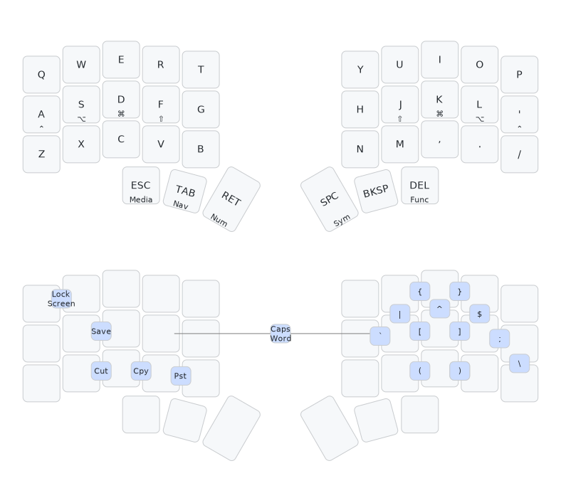
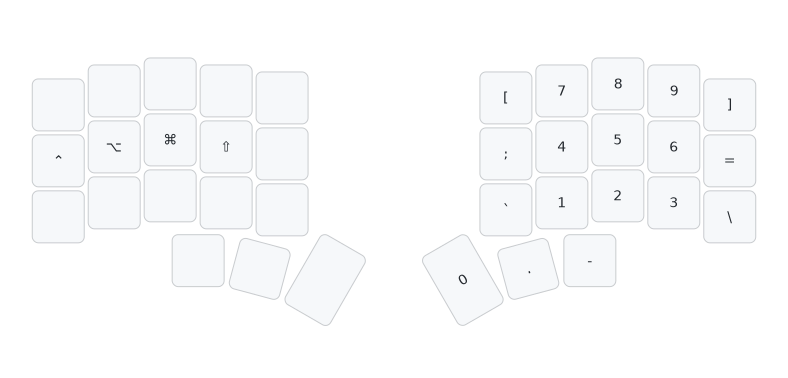
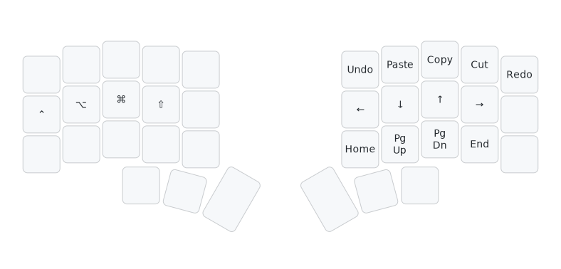
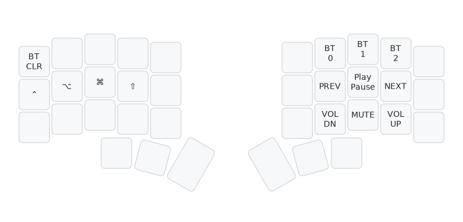
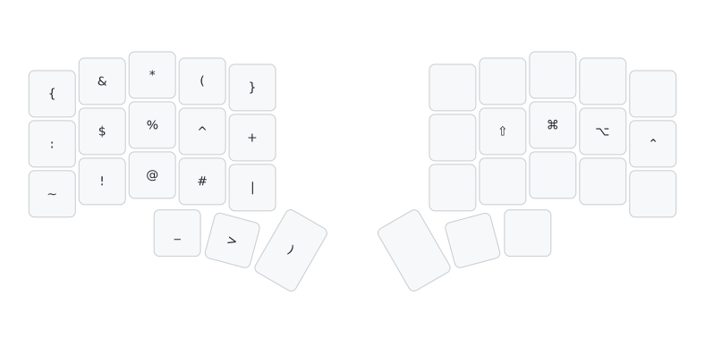
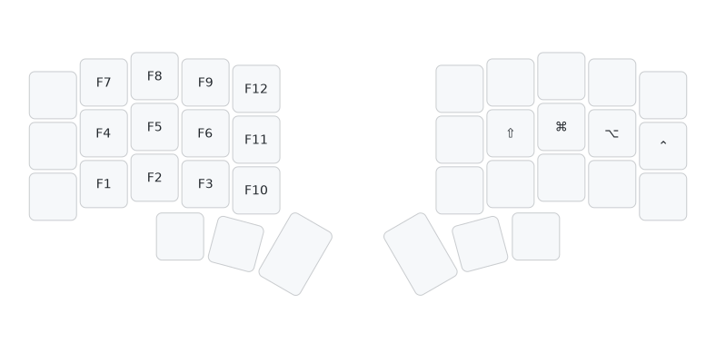

# Keyboard Layout

Highly influenced by the [Miryoku](https://github.com/manna-harbour/miryoku/tree/master/docs/reference) layout.

## Base

## Number

## Navigation

## media

## Symbol

## Function

If you're interested in a bit of history about my split keyboard journey check out my blog post on it [here](https://phrak.dev/blog/corne).
